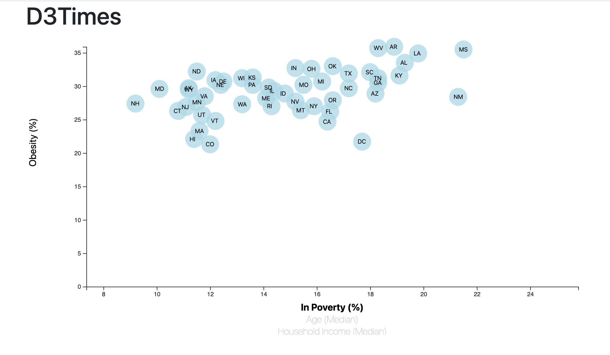
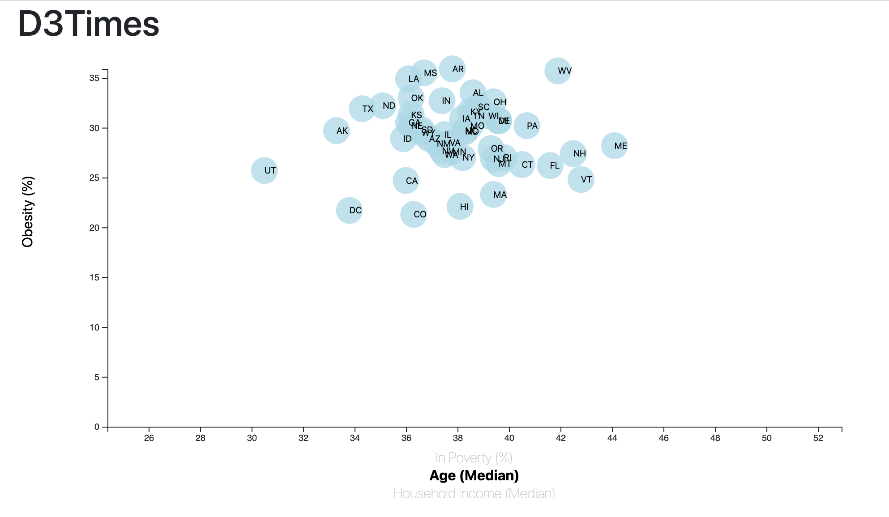
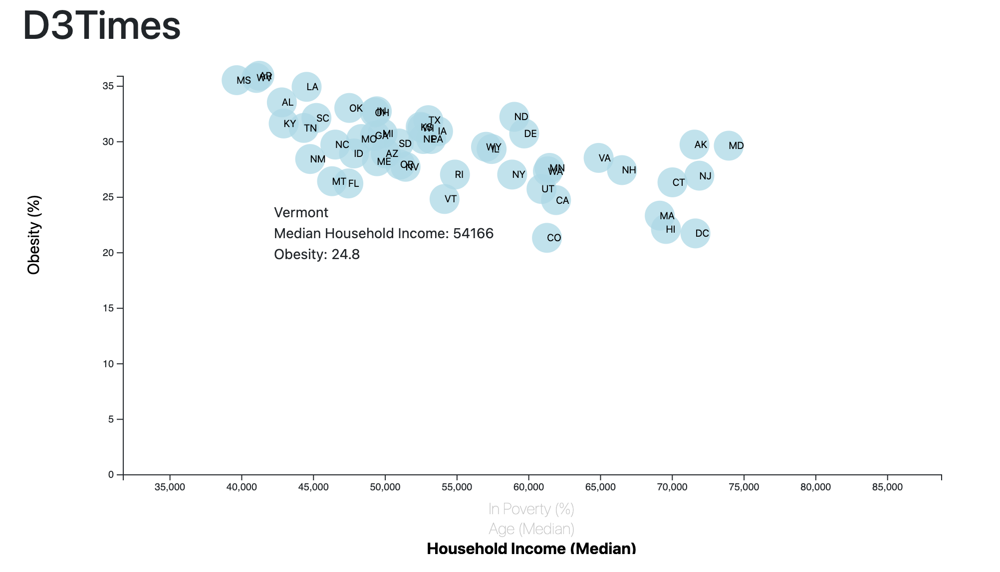

# D3 Homework - Data Journalism and D3

## Background

In this project, I used Javascript and D3 to visualize data from a CSV. I compared Obesity with Age, Income, and Poverty. I created a scatter plot that is interactive, allowing the user to choose what to compare and to see specifics about each data point by hovering over it. 

The data set used is based on 2014 ACS 1-year estimates from the [US Census Bureau](https://data.census.gov/cedsci/). The data set includes data on rates of income, obesity, poverty, etc. by state. MOE stands for "margin of error."

### D3 Analysis

I created a scatter plot that compares `Poverty (%)`, `Median Household Income`, `Median Age` with `Obesity`.

Using D3 techniques, I created a scatter plot that represents each state with circle elements. I coded this graphic in the `app.js` file found [here](Code/assets/js/app.js), pulled in the data from the [data.csv](Code/assets/data/data.csv) by using the `d3.csv` function.

* I included state abbreviations in the circles.

* I created and situated my axes and labels to the left and bottom of the chart.

* I placed additional labels in my scatter plot's x-axis and gave them click events so that users can decide which data to display. I animated the transitions for my circles' locations as well as the range of your axes. I did this for the three x-axis options

* I added tooltips to display each data point's `State`, `Chosen X-Axis`, and `Obesity (%)` so that the user can easily see the specifics of each cirlce.

* Note: You'll need to use `python -m http.server` to run the visualization. This will host the page at `localhost:8000` in your web browser.

### Visualizations

Poverty compared with Obesity

Median Age compared with Obesity

Median Household Income with Obesity
